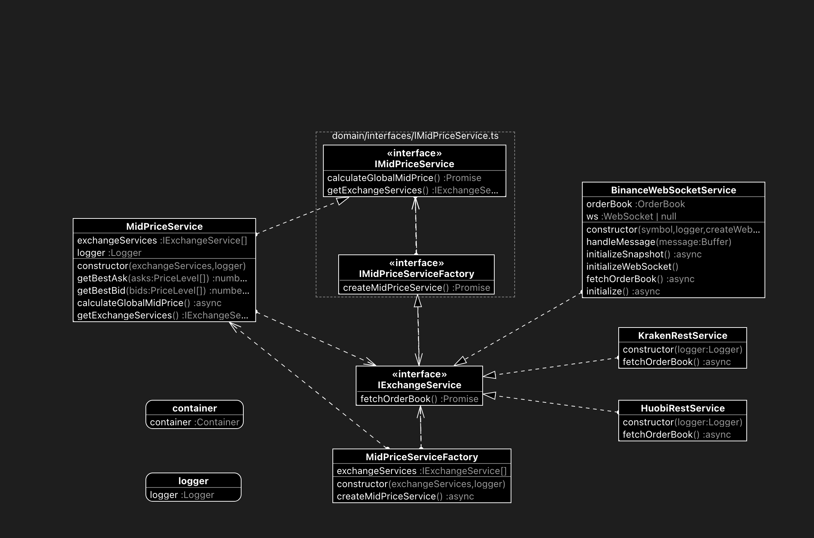
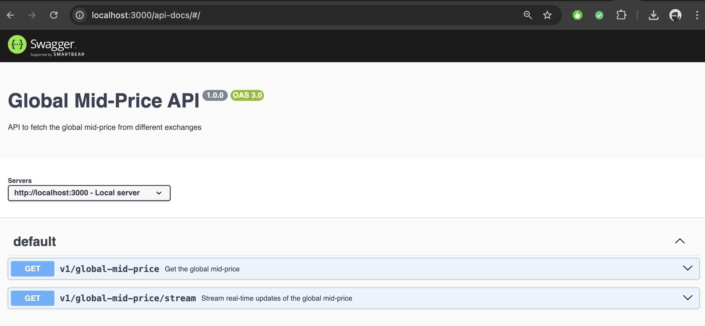

# Exchange MidPrice Service

This project is a **TypeScript-based** application that retrieves and manages mid-prices from multiple cryptocurrency exchanges using **Express**, **Inversify**, **Jest**, **Winston**, and **Swagger**. The code adheres to **SOLID principles** and implements **Clean Architecture**, utilizing **Dependency Injection (DI)** and **Inversion of Control (IoC)** through **Inversify**. A **Factory Pattern** has been used to easily integrate additional exchanges.

---

## 🚀 Features

- **Clean Architecture:** Clear separation of concerns between different application layers.
- **DI and IoC:** Use of Inversify for managing dependencies.
- **Factory Pattern:** Simplifies the extension of exchange services.
- **Logging:** Winston logger for enhanced traceability.
- **Swagger API Documentation:** Comprehensive API documentation with Swagger UI.
- **Unit Testing:** Tests written with Jest to ensure code reliability.

---

## 🗂 Project Structure

- src
  - app.ts # Application entry point
  - application # Core business logic layer
    - MidPriceService.ts
    - MidPriceServiceFactory.ts
    - **tests**
      - MidPriceService.test.ts
      - MidPriceServiceFactory.test.ts
  - domain # Core entities and interfaces
    - SymbolsForDI.ts
    - entities
      - Binance.ts
      - GlobalMidPrice.ts
      - OrderBook.ts
    - interfaces
      - IExchangeService.ts
      - IMidPriceService.ts
  - infrastructure # Service implementations and DI container
    - Logger.ts
    - **tests**
      - Container.test.ts
    - container.ts
    - services
      - rest
        - HuobiRestService.ts
        - KrakenRestService.ts
        - **tests**
          - HuobiRestService.test.ts
          - KrakenRestService.test.ts
      - websocket
        - BinanceWebSocketService.ts
        - **tests**
          - BinanceWebSocketService.test.ts
  - presentation # API routes and Swagger documentation
    - swagger.ts
    - v1
      - routes.ts

---

## 🖼️ Images

### Class Diagram

### Swagger

## 

---

## 📑 API Endpoints

- **GET /global-mid-price:** Retrieves the computed global mid-price from multiple exchanges.
- **GET /stream-global-mid-price:** Streams the real-time global mid-price using **Server-Sent Events (SSE)**.

---

## 📚 How to Run

1.  Clone the repository and navigate to the project directory.
2.  Install dependencies:
    `npm install`
3.  Run the project in production mode:
    `npm start`
4.  For development mode with hot reloading:
    `npm run dev`

---

## 🧪 Running Tests

To execute unit tests:
`npm test`

---

## 🧹 Linting

To lint the codebase:
`npm run lint`

---

## 🔧 Pending Improvements

- Add support for environment variables to replace hardcoded API URLs.
- Implement integration tests.
- Enhance error handling and retries for exchange services.

---

## 📜 License

This project is licensed under the MIT License.
